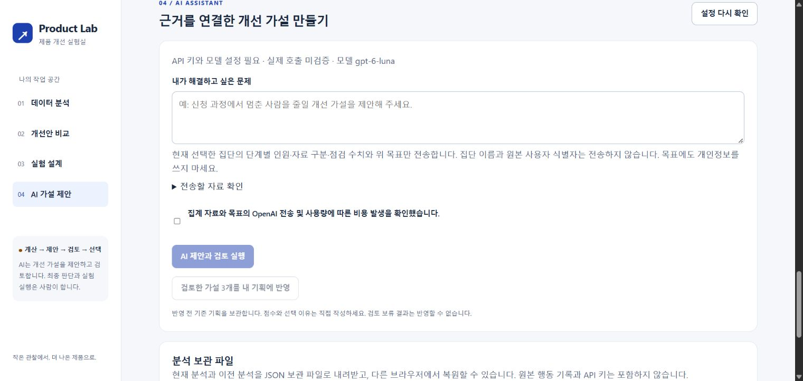
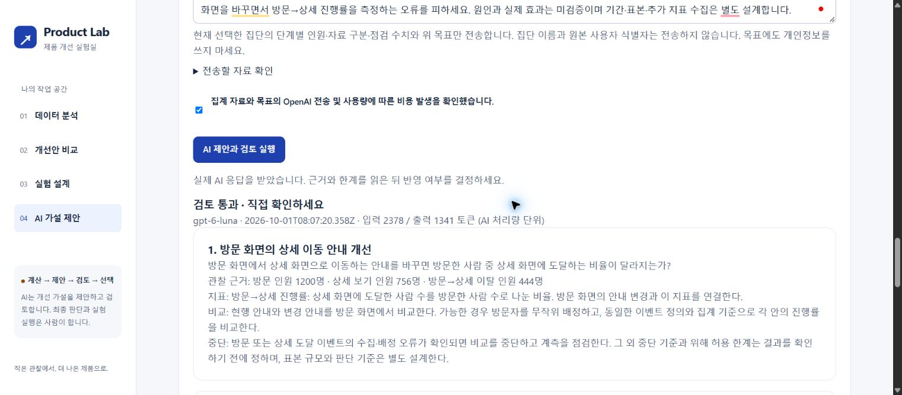

# 제품 개선 실험실 / Product Lab v0.3

사용자 행동을 분석하고, 개선 가설을 비교한 뒤 실험을 기획하는 웹서비스입니다. 기획과 데이터 분석을 연결하는 최종 프로젝트입니다. 서비스의 계산·자료 처리 기준을 만든 뒤, AI 가설 제안과 별도 검토를 연결했습니다.

## 대상과 해결할 문제
분석 경험을 쌓는 기획자가 대상입니다. 차트의 숫자를 확인한 뒤 무엇을 바꿀지 결정하고, 그 결정을 어떻게 검증할지 기록하는 과정을 돕습니다. 관찰 → 가설 비교 → 사람의 선택 → 실험 계획을 한 화면에서 연결합니다. 문제의 빈도·사용자의 실제 수요는 아직 조사하지 않았습니다.

## 현재 기능
- 전체·모바일·데스크톱의 단계별 이탈, 진행률, 전체 완료율
- 집계 인원 직접 입력 또는 사용자 행동 CSV 파일 선택·내용 붙여넣기
- 한국 시간의 분석 기간 설정과 중복·기간 밖·방문 없음·순서 미충족 기록 점검
- 분석 적용 전에 점검 결과와 예상 집계 인원 확인
- 개선 가설 3개의 제목·내용 직접 수정, 영향·근거 확신·노력 평가
- 가설별 실험 계획, 선택 이유, 판단 기준과 중단 조건 저장
- 이전 분석 보관함과 복원, 브라우저 새로고침 후 복구
- 진행률 증가를 가정한 계산, 자료 점검 내용을 포함한 기획 보고서 내려받기
- 빈 CSV 입력 양식·가상 시험 자료 내려받기
- 목표 입력·전송 자료 확인·전송 및 비용 동의 후 AI 실행
- 가설 생성 → 코드 형식·근거 검사 → 별도 AI 검토 → 사람이 채택
- 검토 보류·분석 조건 변경 시 채택 차단, 실제 모델·시각·사용량 표시
- 전체 분석과 보관함의 JSON 파일 내려받기·검증 후 복원

**실제 OpenAI 연결·가설 생성·별도 검토·기획 반영까지 가상 자료로 확인했습니다.** 예시 가설·직접 작성·AI 채택을 구분합니다. 사용자 조사와 실제 개선 성과는 확인하지 않았습니다.

## 실행과 시험
Node.js 24 이상이 있는 컴퓨터에서 이 폴더의 터미널에 `npm start`를 입력하고 http://127.0.0.1:4197 에 접속합니다. 추가 패키지를 설치할 필요가 없습니다. 터미널 실행은 Ctrl+C로 종료합니다.

`npm test`로 계산·CSV·AI 흐름·서버 검증 22개를 실행합니다. 첫 버전은 별도 v01 폴더와 4178 주소에 보존되어 있습니다. v03은 별도 브라우저 저장 공간을 쓰며 기존 v01·v02를 보존했습니다.

## 첫 확인 방법
‘행동 자료 가져오기’ → ‘가상 자료로 바로 시험’을 선택하면 입력 29건·중복 제거 1건·방문 12명·상세 보기 8명·신청 시작 5명·완료 3명이 보입니다. ‘점검 결과로 새 분석 시작’을 누르면 완료율 25.0%가 표시됩니다. **모두 가상 자료입니다.**

## 행동 자료 입력 기준
CSV는 쉼표로 열을 나눈 표 파일입니다. UTF-8 인코딩, 최대 2MB·10,000개 행동 기록을 지원합니다. 열 이름은 아래 네 개이며 순서는 바꿀 수 있습니다.

| 열 이름 | 의미 | 허용 예시 |
| --- | --- | --- |
| user_id | 같은 사람을 구분하는 익명 식별자 | demo-01 |
| event | 사용자가 한 행동 | visit, detail, application_start, application_complete |
| occurred_at | 시간대가 포함된 행동 시각 | 2026-10-01T10:00:00+09:00 |
| device | 행동 당시 기기 | mobile, desktop |

이름·이메일·전화번호 대신 익명 식별자를 사용하세요. 식별자를 익명으로 바꾸는 기능은 제공하지 않습니다. 파일과 붙여넣은 내용을 함께 입력하면 붙여넣은 내용을 우선합니다. 빈 양식은 열 이름만 들어 있으므로 행동 기록을 넣어야 분석됩니다.

### 집계 규칙
1. 사용자·행동·시각·기기가 정확히 같은 기록은 한 번만 남깁니다. ISO 시각의 표현이 달라도 같은 시각이면 중복으로 봅니다.
2. 한국 시간 시작일 00:00부터 종료일 다음 날 00:00 전까지의 행동만 분석합니다. 기간 밖 행동은 제외 건수로 표시합니다.
3. 기간 안에 visit가 있는 사용자만 방문 집단에 포함합니다. 방문 없는 사용자 수를 따로 표시합니다.
4. 기간 안의 첫 방문 기기로 집단을 고정합니다. 한 사람이 기기를 바꿔도 두 집단에 중복 포함하지 않습니다.
5. visit → detail → application_start → application_complete 순서를 지키고 각 단계 시각이 이전 단계보다 늦을 때만 인원에 포함합니다. 각 사람은 단계마다 한 번만 셉니다.
6. 단계 누락·역순·같은 시각으로 진행 증거가 부족한 기록은 순서 미충족 건수로 표시합니다. 나중에 올바른 순서의 기록이 나오면 그 기록으로 진행할 수 있습니다. 동일 시각 기록이 있는 사용자 수는 별도 경고이며, 전체 사용자를 제외한다는 뜻이 아닙니다.
7. 지원하지 않는 행동·기기·잘못된 날짜·시간대 누락·CSV 형식 오류는 조용히 버리지 않고 분석을 멈춥니다. 잘못된 파일로 기존 분석을 교체하지 않습니다.

같은 식별자가 실제 한 사람인지, 수집에서 행동이 빠졌는지는 확인하지 못합니다. 분석 기간 종료 직전 방문자는 완료할 시간이 짧을 수 있습니다. 기간 밖에서 시작한 사용자와 기간 이후 완료한 사용자는 이번 집계에 포함하지 않으므로 실제 구매 여정 전체와 다를 수 있습니다.

### 계산과 해석
진행률 = 다음 단계 인원 / 현재 단계 인원, 이탈 인원 = 현재 단계 인원 - 다음 단계 인원, 전체 완료율 = 완료 인원 / 방문 인원입니다. 분모가 0이면 ‘계산 불가’를 표시합니다.

최대 이탈 구간은 인원 기준이며 비율 기준과 다를 수 있습니다. 동률은 먼저 나온 구간입니다. 차이가 있다는 사실만으로 원인을 단정하지 않습니다. 인원 직접 입력은 순서·정수·범위만 검사하며 고유 사용자와 기간은 확인하지 못합니다.

우선순위 점수 = 영향 × 근거 확신 / 노력, 각각 1~5의 주관적 평가입니다. 예시 점수는 검증된 근거가 아닙니다. 가설은 최대 3개 후보를 직접 수정하는 방식이며 후보 추가·삭제는 이번 버전에 포함되지 않습니다.

시뮬레이션은 선택 단계 진행률만 증가하고 이후 진행률·유입 인원은 유지된다는 가정입니다. 진행률 상한은 100%입니다. 인과관계나 실제 개선 효과를 예측하지 않습니다.

## 보관과 개인정보
원본 CSV는 서버나 AI로 보내지 않습니다. 브라우저 저장 공간에는 집계 인원·자료 점검 수치·가설·계획만 남기며 행동 기록과 사용자 식별자는 저장하지 않습니다. 분석 제목·가설·계획에 직접 쓴 내용은 저장되므로 개인정보를 작성하지 마세요.

새 자료를 적용하기 전에 현재 분석을 보관함에 복사합니다. 보관에 실패하면 새 분석을 적용하지 않습니다. 이전 분석을 열 때도 현재 분석을 보관합니다. 브라우저 저장 공간을 삭제하거나 다른 주소·기기를 사용하면 기존 자료를 볼 수 없습니다. 중요한 계획은 보고서로 내려받으세요. 보관함 전체 백업·가져오기는 아직 없습니다.

## 기획 결정
- 서비스 계산을 먼저 구현: AI의 문장을 비교할 정확한 계산 기준이 필요하기 때문입니다.
- 기본 대상은 온라인 클래스 신청: 네 단계의 행동으로 분석과 실험 기획을 설명하기 위한 기본값이며 사용자 조사 결과가 아닙니다.
- 시각이 같은 기록의 순서를 추정하지 않음: CSV 행 순서로 사용자 행동 순서를 만들어내지 않기 위해서입니다.
- 입력 자료를 점검한 후 적용: 제외된 자료와 집계 기준을 사용자가 먼저 확인하도록 했습니다.
- 사람의 가설과 선택 이유를 보존: AI 추천을 그대로 선택하기보다 사용자 판단을 기록하도록 했습니다.
- 첫 버전과 이전 분석 보존: 결과를 비교할 수 있도록 폴더 및 브라우저 보관함을 분리했습니다.

## 검증한 범위
자동 검증 13개: 기본 합계·집단·0명·인원 모순·시뮬레이션·점수, CSV 따옴표·BOM·열 순서, 중복·반복 방문·기기 변경, 역순·동일 시각, 한국 날짜 경계, 잘못된 행동·날짜·시간대.

브라우저 검증: 가상 자료 점검→적용, CSV 내용 붙여넣기 점검, 오류 후 적용 비활성화, 직접 가설 수정 후 새로고침 유지, 이전 분석 복원, 양식과 가상 자료 다운로드. 브라우저 자동화 확장 기능의 파일 접근 권한 제한으로 파일 선택 방식의 자동 검증은 완료하지 못했습니다. 파일 선택을 통한 실제 사용자 확인은 남아 있습니다. 실제 개인정보 자료나 실제 사용자의 개선 효과는 시험하지 않았습니다.

## AI 설정과 문서
로컬 실습의 키 파일은 `final project/.env`입니다. 서버는 상위 폴더의 `.env`를 우선 읽고, 없으면 서버와 같은 폴더의 `.env`를 읽습니다. 키는 해당 파일의 `OPENAI_API_KEY=` 뒤에 직접 입력합니다. `.env.example`은 빈 설정 양식이며 `.env`는 Git에서 제외됩니다. 키가 없으면 AI 실행 버튼은 잠기지만 분석·기획 기능은 사용할 수 있습니다.

- [API 키 발급과 설정](API_KEY_SETUP.md)
- [에이전트 유형·개발 과정·판단 근거](AGENT_DESIGN.md)
- [검증 범위와 제출 안내](SUBMISSION.md)

정해진 순서로 일하는 기획 보조 에이전트입니다. 같은 모델의 두 호출로 제안과 검토 역할을 나눕니다. 별도 검토는 실제 효과 검증이 아니며 최종 판단을 사람이 합니다. AI 실행 동의 때 익명 집계와 목표를 OpenAI로 전송합니다. 현재는 로컬 컴퓨터에서만 서버를 실행하는 구성입니다. GitHub Pages에 정적 파일만 올리면 AI 서버 기능은 동작하지 않습니다.

## 포트폴리오에서 보여줄 것
1. 사용자 행동을 어떤 기준으로 집계했는지 설명합니다.
2. 관찰 숫자에서 미검증 가설을 도출하고, 세 가설 중 하나를 고른 이유를 씁니다.
3. 직접 정한 지표·비교 조건·중단 기준을 담은 보고서를 보여줍니다.
4. AI에게 맡긴 부분과 코드·사람이 검증한 부분을 구분합니다.

실제 자료 수집·사용자 시험·실험 배정과 실행·통계적 효과 검정·다중 사용자 로그인·공개 서버 배포는 구현 범위에 포함하지 않았습니다. 실제 연동 기능 시험은 완료했으며, 발표자의 직접 사용 확인은 남아 있습니다. 이 저장소의 테스트 데이터와 예시 숫자를 실제 성과로 발표하지 않습니다.

## 구현 화면

아래는 API 키 미설정 상태입니다. 실제 호출 성공 화면이 아닙니다.

## 실제 연동 확인

2026-10-01 가상 자료로 실제 API를 실행했습니다. 첫 제안은 개입과 지표 불일치를 찾아 검토 보류, 목표를 명확히 지정한 두 번째 제안은 검토 통과했습니다. 기존 기획 보관과 반영, 분석 조건 변경 시 반영 차단을 확인했습니다. 시험용 채택은 사용자의 최종 판단이 아닙니다.

- [첫 실행의 검토 보류 결과](ai-review-2026-10-01-v01.md)
- [수정 목표로 실행한 검토 통과 결과](ai-review-2026-10-01-v02.md)

