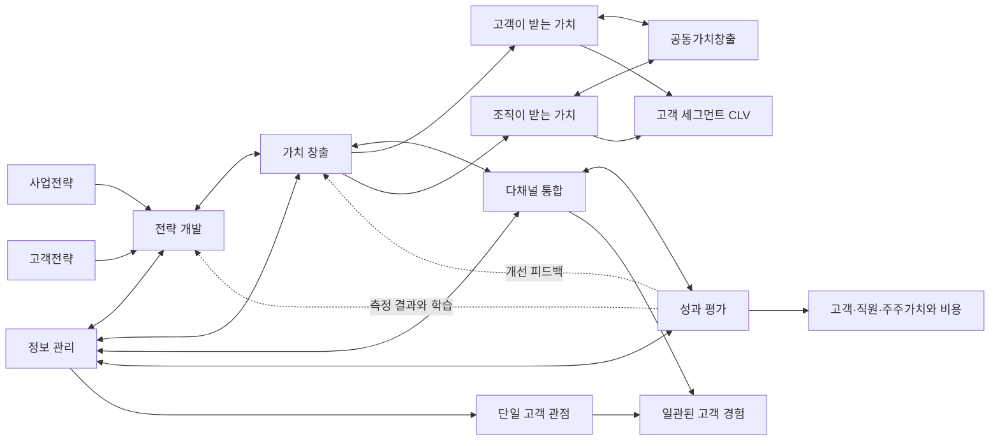
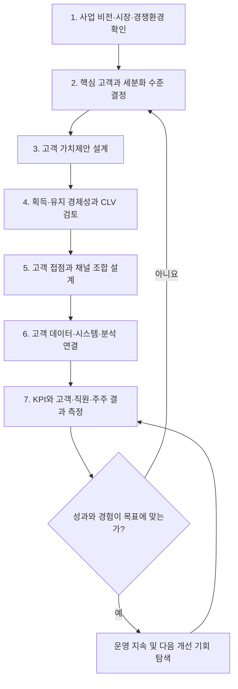
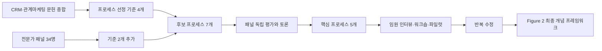

# 전략적 CRM 프레임워크 학습 보고서

> 대상 논문: Adrian Payne & Pennie Frow (2005), **A Strategic Framework for Customer Relationship Management**, *Journal of Marketing*, 69(4), 167-176.  
> 공식 원문 정보: [SAGE Journals](https://journals.sagepub.com/doi/full/10.1509/jmkg.2005.69.4.167) · [DOI](https://doi.org/10.1509/jmkg.2005.69.4.167)  
> 페이지 표기는 PDF 화면 번호가 아니라 **학술지 인쇄 페이지 167-176**을 기준으로 한다.

## 읽기 안내: 세 층위를 구분하는 법

- **[논문 주장]** 저자들이 논문에서 직접 제안하거나 주장한 내용
- **[실제 근거]** 인터뷰, 전문가 패널, 워크숍, 문헌 검토 등 논문이 실제로 제시한 자료
- **[우리의 해석]** 위 근거가 허용하는 범위 안에서 내린 학습용 해석

이 논문은 통계 실험 논문이 아니라 **개념적 프레임워크 개발 연구**다. 따라서 “실험 결과”는 통제집단이나 효과크기가 아니라, 문헌 종합·전문가 합의·현장 적용을 통한 개념 정련을 뜻한다.

---

## 1. Executive Summary

이 논문의 핵심은 CRM을 고객관리 소프트웨어로 보는 좁은 관점에서 벗어나, **사업전략 → 고객가치 → 고객 접점 → 고객정보 → 성과측정**을 연결하는 전사적 운영체계로 보자는 것이다. 저자들은 이를 다섯 개의 상호의존적 프로세스로 정리한다: **전략 개발, 가치 창출, 다채널 통합, 정보 관리, 성과 평가**. [논문 주장: pp.167-174; Figure 1 p.168; Figure 2 p.171]

새로운 점은 흩어져 있던 CRM·관계마케팅·고객가치·정보기술·성과관리 개념을 **하나의 교차기능적 프로세스 지도**로 통합했다는 데 있다. 마케팅, 영업, 고객센터, IT, 운영, 재무가 부서별로 따로 일하는 대신 동일한 고객가치와 사업성과를 향해 연결되어야 한다는 주장이다. [논문 주장: pp.169-174]

저자들은 문헌 검토와 함께 CRM·IT 실무자 34명의 전문가 패널, 여러 임원 인터뷰, 공급업체·컨설턴트 워크숍, 기업 파일럿을 활용했다. 다섯 프로세스 모두 첫 번째 선정 과정에서 전문가 패널의 3분의 2 이상에게 중요하고 일반적인 프로세스로 인정되었다. [실제 근거: pp.169-170]

그러나 이 논문에는 매출, 유지율, 고객생애가치 또는 주주가치의 전후 비교가 없다. 통제 실험, 통계적 유의성, 인과효과 검증도 없다. 따라서 **프레임워크가 실무적으로 이해 가능하고 계획 도구로 사용되었다는 점은 뒷받침되지만, 실제 성과를 높인다고 입증되지는 않았다.**

BA 관점에서 가장 중요한 학습은 다음 질문을 계속 연결하는 것이다.

> 어떤 사업 목표를 위해, 어떤 고객에게, 어떤 가치를, 어떤 접점과 데이터로 제공하고, 무엇으로 성과를 측정할 것인가?

---

## 2. Glossary

### 먼저 알아야 하는 필수 개념

| 용어 | 쉬운 설명 | 논문 위치 | 학습 우선순위 |
|---|---|---|---|
| CRM | 핵심 고객·세그먼트와 수익성 있는 장기 관계를 만들기 위해 전략, 데이터, 기술, 사람, 운영을 통합하는 접근 | pp.167-168; Figure 1 | 필수 |
| 관계마케팅 | 한 번의 판매보다 고객과의 장기 관계와 상호가치에 초점을 두는 마케팅 관점 | pp.167-168 | 필수 |
| 교차기능 프로세스 | 마케팅·영업·IT처럼 여러 부서가 하나의 고객·사업 결과를 위해 연결해 수행하는 처음부터 끝까지의 업무 흐름 | p.169 | 필수 |
| 고객중심성 | 모든 요구를 무조건 수용하는 것이 아니라, 선택한 핵심 고객에게 의미 있는 가치를 제공하도록 조직을 설계하는 관점 | pp.168-172 | 필수 |
| 고객전략 | 어떤 고객 또는 고객집단과 어떤 관계를 만들지 정하는 방향 | p.170; Figure 2 | 필수 |
| 세분화 세밀도 | 고객을 큰 집단, 작은 집단, 1대1 수준 중 얼마나 세밀하게 나눌지 정하는 정도 | p.170 | 필수 |
| 가치제안 | 고객이 왜 이 제안을 선택해야 하는지를 혜택, 요구 충족, 전체 비용 관점에서 설명한 약속 | p.172 | 필수 |
| 가치평가 | 고객이 제품·서비스의 여러 속성을 얼마나 중요하게 생각하는지 평가하는 활동 | p.172 | 중요 |
| 공동가치창출 | 회사가 가치를 일방적으로 전달하는 대신 고객의 참여·사용·피드백 속에서 가치가 함께 만들어진다는 관점 | pp.170-172; Figure 2 | 필수 |
| 고객생애가치(CLV) | 고객 한 명 또는 한 세그먼트와 관계를 유지하는 전체 기간에 기대되는 경제적 가치 | p.172; Figure 2 | 필수 |
| 고객자산 | 여러 고객의 고객생애가치를 전체적으로 본 고객 기반의 가치 | p.172 | 중요 |
| 다채널 통합 | 앱, 매장, 전화, 영업 등 여러 접점의 정보와 서비스 수준을 연결해 일관된 경험을 제공하는 것 | pp.172-173 | 필수 |
| 데이터 저장소 | 고객 데이터를 통합해 저장하고 분석할 수 있게 한 기업의 고객 기억 | p.173 | 중요 |
| 데이터 마이닝 | 많은 데이터에서 의미 있는 패턴과 관계를 찾는 분석 | p.173 | 중요 |
| Front Office | 영업자동화·콜센터처럼 고객과 직접 접촉하는 업무를 지원하는 시스템 | p.173 | 중요 |
| Back Office | 재무·구매·재고·물류처럼 내부 운영을 지원하는 시스템 | p.173 | 중요 |
| KPI | 전략 목표 달성 여부를 반복적으로 확인하는 핵심 측정값 | pp.173-174 | 필수 |
| 피드백 루프 | 측정 결과를 앞 단계의 전략과 실행 개선에 다시 반영하는 순환 구조 | pp.170, 174; Figure 2 | 필수 |
| Interaction Research | 문헌과 여러 실무자 집단의 반복적 상호작용을 통해 개념을 개발·수정하는 연구 접근 | pp.169-170 | 비판적 독해에 필수 |

### 논문을 읽기 전에 알면 좋은 선수 지식

1. **사업전략과 고객전략의 차이**: 회사가 어디에서 경쟁할지와 어떤 고객에게 어떤 관계를 제공할지는 연결되어야 한다.
2. **고객 세분화**: 고객을 행동, 필요, 가치 등에 따라 의미 있는 집단으로 나누는 사고방식이다.
3. **수익과 현재가치의 기초**: CLV를 실제로 계산하려면 수익, 비용, 유지율, 할인율의 개념이 필요하다.
4. **고객여정과 접점**: 고객이 인지부터 구매·사용·문의·재구매까지 거치는 과정과 각 접점을 구분해야 한다.
5. **데이터 구조와 품질**: 같은 고객이 여러 시스템에서 중복되거나 다른 사람으로 인식될 수 있다는 문제를 이해해야 한다.
6. **선행지표와 후행지표**: 고객 만족·사용 빈도는 미래 결과를 예고할 수 있고, 매출·이익은 이미 일어난 결과를 보여준다.

### 별도 학습이 필요한 개념

- **컨조인트 분석**: 속성 조합에 대한 선호를 이용해 각 속성의 상대적 가치를 추정하는 방법. 논문은 예로만 들고 실제 분석은 하지 않는다. [p.172]
- **CLV 계산**: 고객획득비용, 공헌이익, 유지율·이탈률, 할인율, 코호트 분석이 추가로 필요하다.
- **옴니채널과 CDP**: 2005년의 다채널·데이터웨어하우스 논의를 오늘날 환경에 연결하기 위해 필요하다.
- **실험과 인과추론**: CRM 변화가 성과를 실제로 만들었는지 검증하려면 A/B 테스트, 비교집단, 전후 분석이 필요하다.
- **개인정보 보호와 알고리즘 편향**: 이 논문이 충분히 다루지 않은 현대 CRM의 핵심 조건이다.

---

## 3. Paper Walkthrough

### 3.1 문제 정의

**[논문 주장]** CRM에 대한 관심은 커졌지만 CRM이 무엇인지, CRM 전략을 어떻게 개발해야 하는지에 관한 합의가 부족하다. 기업은 CRM을 영업자동화, 데이터베이스, 콜센터, 로열티 프로그램 또는 전자상거래처럼 서로 다르게 이해한다. 좁은 기술 관점이나 단편적인 실행은 CRM 실패에 기여할 수 있다. [Introduction 및 `CRM Perspectives and Definition`, pp.167-168]

**[실제 근거]** 저자들은 기존 CRM 정의들을 검토하고, 인터뷰한 임원들에게서도 다양한 정의가 나타났다고 보고한다. 다만 정의별 빈도, 인터뷰 질문, 코딩 절차는 제공하지 않는다. [pp.167-168; Appendix pp.174-175]

**[우리의 해석]** 논문의 문제는 좋은 CRM 제품을 고르는 문제가 아니라, 전략·고객가치·채널·데이터·성과를 조직 전체에서 연결하는 문제다.

### 3.2 기존 접근법

- CRM을 특정 기술 구축으로 보는 좁고 전술적인 접근
- 여러 고객용 기술을 통합하는 폭넓은 기술 접근
- 고객관계를 통해 고객가치와 주주가치를 만들려는 총체적·전략적 접근 [Figure 1, p.168]
- 기존 프레임워크 중 Winer(2001)는 데이터베이스, 분석, 고객선택, 타기팅, 관계 구축, 개인정보, 성과지표를 제시했지만, 저자들은 이를 교차기능 프로세스 모델로 보기는 어렵다고 평가한다. [p.169]
- 다른 기존 모델들도 유용하지만 전략적이고 교차기능적인 프로세스 기반 틀이 부족하다고 주장한다. [p.169]

### 3.3 핵심 아이디어

CRM은 단일 부서나 시스템이 아니라 다음 다섯 프로세스가 피드백을 주고받는 운영체계다. [pp.170-174; Figure 2 p.171]

1. **전략 개발**: 사업전략과 고객전략을 정렬한다.
2. **가치 창출**: 고객이 받는 가치와 회사가 받는 가치를 함께 설계한다.
3. **다채널 통합**: 여러 접점에서 일관된 고객 경험을 제공한다.
4. **정보 관리**: 접점 데이터를 수집·결합·분석하여 통찰과 행동을 만든다.
5. **성과 평가**: 고객·직원·주주가치와 비용, KPI를 측정하고 결과를 다시 앞 단계에 반영한다.

### 3.4 제안 방법

#### 프레임워크를 만든 연구 방법

1. CRM·관계마케팅·관련 비즈니스 문헌에서 정의와 후보 프로세스를 수집했다. [pp.168-170]
2. 선행연구의 프로세스 선정 기준 4개를 사용했다: 조직 목표에 중요한 소수의 프로세스, 가치 창출 기여, 전략·거시 수준, 분명한 상호관계. [p.169]
3. CRM·IT 실무자 34명 패널이 기준을 검토하고, 교차기능성과 실무적 논리·유용성이라는 기준 2개를 추가했다. [p.169]
4. 문헌과 실무자 상호작용으로 7개 후보 프로세스를 만든 뒤 패널의 독립 평가와 토론을 통해 5개로 좁혔다. [pp.169-170]
5. 임원 인터뷰, 공급업체·컨설턴트 워크숍, 기업 파일럿, 학회 의견을 반영하며 프레임워크를 반복 수정했다. [pp.169-170]

#### 논문이 보고한 참여 자료원

- 전문가 패널 34명: 평균 경력 17.2년, 평균 나이 40.2세, 9개국 출신
- 금융서비스 기업의 CRM·마케팅·IT 임원 20명 인터뷰
- 대형 CRM 공급업체 임원 6명과 3개 컨설팅사 임원 5명 인터뷰
- 18개 CRM 공급업체·분석가·고객사가 포함된 토론과 워크숍
- 금융서비스·자동차 분야 파일럿
- 글로벌 통신회사와 글로벌 물류회사에서 회사별 6회 워크숍

위 집단 사이에 사람이 겹치는지는 보고되지 않으므로 숫자를 모두 더해 전체 표본 수로 제시하면 안 된다. [p.169]

### 3.5 다섯 프로세스 자세히 보기

#### 1) Strategy Development Process

- 사업 비전과 산업·경쟁환경을 검토한다.
- 현재·잠재 고객 중 누구를 선택할지, 고객을 얼마나 세밀하게 나눌지 정한다.
- 사업전략과 고객전략의 정렬을 강조한다. [pp.170-171; Figure 2]

#### 2) Value Creation Process

- 고객이 받는 가치: 가치제안과 가치평가
- 조직이 받는 가치: 고객획득·유지 경제성
- 양쪽을 잇는 고객 세그먼트 생애가치 분석과 공동가치창출 [pp.170-172; Figure 2]

#### 3) Multichannel Integration Process

- 영업인력, 지점·매장, 전화, 직접마케팅, 전자상거래, 모바일상거래를 연결한다.
- 고객이 여러 채널을 이동해도 긍정적이고 일관된 경험과 단일 고객 관점을 제공하는 것이 목표다. [pp.172-173; Figure 2]

#### 4) Information Management Process

- 데이터 저장소, IT 시스템, 분석도구, Front Office와 Back Office 애플리케이션으로 구성된다.
- 여러 접점의 고객 데이터를 수집·결합·활용해 고객 통찰과 적절한 마케팅 반응을 만든다. [p.173; Figure 2]

#### 5) Performance Assessment Process

- 거시 결과: 직원가치, 고객가치, 주주가치, 비용절감
- 세부 모니터링: 표준, 정량·정성 측정, 결과, KPI
- 미래 성과를 예고하는 지표와 다섯 프로세스 전체의 피드백을 강조한다. [pp.173-174; Figure 2]

### 3.6 실험과 평가

이 논문에는 전통적인 의미의 실험이 없다.

**[실제 근거]**

- 다섯 프로세스 각각이 첫 번째 선정 과정에서 전문가 패널의 3분의 2 이상에게 중요하고 일반적인 프로세스로 인정되었다. [p.170]
- 여러 실무자 집단과 기업 워크숍을 통해 프레임워크가 반복 수정되었다. [pp.169-170]
- 일부 기업에서 문제 발견, 전략 계획, 우선순위 설정, 변화의 공통 틀, 벤치마킹 용도로 사용되었다고 저자들이 보고한다. [Discussion, p.174]

**제시되지 않은 것**

- 통제집단·비교집단
- 통계적 유의성·효과크기
- 적용 전후의 매출, 유지율, CLV, 주주가치
- 인터뷰 원문과 체계적인 코딩 절차
- 실패 사례와 부정적 결과
- 독립 연구자의 반복 검증

**[우리의 해석]** 이 연구의 평가는 성과효과 검증이 아니라, 선택된 전문가들이 구조를 납득하고 일부 기업이 계획 도구로 사용했는지를 보는 **내용 타당성·현장 사용 가능성 점검**에 가깝다.

### 3.7 결과

**[논문 주장]** 전략적 CRM은 다섯 개의 교차기능 프로세스로 설명할 수 있으며, 제안한 프레임워크는 CRM 전략 개발과 실행을 이해하는 데 도움을 줄 수 있다. [Abstract; pp.170-174]

**[실제 근거]** 전문가 합의, 반복적인 실무자 검토, 기업 계획 과정에서의 사용이 확인된다. [pp.169-170, 174]

**[우리의 해석]** 이 논문은 “CRM 성과가 올랐다”는 결과보다, “CRM을 검토할 때 빠뜨리지 말아야 할 영역을 한눈에 보는 지도”를 제공한다.

### 3.8 한계

- 직원 참여와 변화관리 같은 사람·실행 문제를 분석하지 않았다. [저자 명시: pp.167, 174]
- 대기업 중심이며 중소기업과 비영리조직은 조사하지 않았다. [저자 명시: p.174]
- 5개 프로세스가 실제 성과에 미치는 영향을 측정하지 않았다.
- 패널의 정확한 득표, 탈락한 2개 후보, 인터뷰 질문과 분석 절차가 공개되지 않았다.
- 대기업 임원, 공급업체, 컨설턴트 중심이라 선택 편향 가능성이 있다.
- 고객과 일선 직원의 관점이 거의 없다.
- 2005년의 채널과 기술시장 분류는 오늘날의 소셜, 메신저, CDP, AI 환경과 다르다.

---

## 4. Concept Map

이 그림은 Figure 2를 그대로 복제한 것이 아니라, 학습을 위해 관계를 단순화한 설명용 재구성이다. 논문에서 양방향 화살표는 프로세스 간 상호작용과 피드백, 가치 창출 안의 원형 화살표는 공동가치창출을 뜻한다. [설명 p.170; Figure 2 p.171]

---

## 5. Method Diagram

### 기업이 프레임워크를 사용하는 흐름

주의: 논문의 Figure 2는 엄격한 일방향 순서도가 아니다. 위 흐름은 BA가 적용하기 쉽게 순서를 붙인 **우리의 설명용 해석**이며, 원문은 다섯 프로세스가 반복적으로 상호작용한다고 본다.

### 저자들이 프레임워크를 만든 연구 흐름

---

## 6. Evidence Table

| 주요 주장 | 실제로 제시된 근거 | 위치 | 근거 강도 | 주의할 점 |
|---|---|---|---|---|
| CRM은 기술 프로젝트보다 넓은 전략적 개념이어야 한다 | 기존 정의 검토와 실무자 인터뷰에서 서로 다른 CRM 인식 확인 | pp.167-168; Figure 1; Appendix pp.174-175 | 중간 이하 | 전략적 정의가 더 높은 성과를 만든다는 직접 비교는 없음 |
| CRM 관점은 세 유형의 연속선으로 볼 수 있다 | 정의들을 기술 강조 정도에 따라 저자들이 분류 | p.168; Figure 1 | 개념적으로 중간, 실증적으로 약함 | 코딩 기준, 평가자 일치도, 대안 분류 비교가 없음 |
| 프로세스 선택에는 6개 기준이 적절하다 | 선행연구의 4개 기준을 패널이 만장일치 승인하고 2개 추가 | p.169 | 중간 | 패널 선정과 집단 토론이 합의에 미친 영향 불명 |
| 전략적 CRM은 5개 프로세스로 구성된다 | 34명 패널에서 모두 3분의 2 이상 동의, 다른 관리자 집단의 추가 검토 | pp.169-170; Figure 2 p.171 | 중간 | 정확한 득표수, 탈락 과정, 완전성 검증 없음 |
| 다섯 프로세스는 서로 피드백을 주고받는다 | 문헌 종합, 관리자 상호작용, Figure 2의 양방향 화살표 | pp.170-174; Figure 2 | 약함-중간 | 화살표는 측정된 인과관계나 효과크기가 아님 |
| 고객가치와 기업가치를 함께 설계해야 한다 | 가치제안·공동가치창출·CLV 관련 선행문헌을 하나의 과정으로 통합 | pp.170-172; Figure 2 | 문헌 기반 중간 | 논문 자체의 고객·수익 데이터는 없음 |
| CLV 분석은 수익성 높은 고객에 집중하게 한다 | 고객유지·고객자산 선행연구 인용 | p.172; Figure 2 | 간접 근거 | 계산법, 비용 배분, 공정성과 장기 부작용 미검증 |
| 다채널 통합은 매우 중요한 CRM 과정이다 | 관련 문헌과 기업 사례를 통한 논리적 설명 | pp.172-173; Figure 2 | 약함 | 저자도 연구가 적다고 인정하며 프로세스 중요도 비교가 없음 |
| 고객정보 통합과 분석은 고객 통찰과 대응을 가능하게 한다 | 데이터 저장소·IT·분석도구·업무 시스템 관련 문헌과 실무 설명 | p.173; Figure 2 | 개념적으로 중간 | 데이터 통합 정도와 성과 관계를 직접 측정하지 않음 |
| CRM은 고객·직원·주주가치와 비용을 함께 봐야 한다 | 서비스-이익 사슬과 균형성과표 등 선행연구 | pp.173-174; Figure 2 | 간접 근거 | 이 연구의 기업에서 주주가치 상승을 관찰한 것은 아님 |
| 프레임워크는 문제 발견·계획·우선순위·벤치마킹에 쓰였다 | 저자들의 기업 적용 경험에 관한 서술 | p.174 | 약함-중간 | 산출물, 사용자 평가, 실패 사례, 개선 수치가 없음 |
| 프레임워크가 CRM 성공에 도움을 줄 수 있다 | 문헌 종합과 실무자 상호작용 전체 | Abstract; pp.169, 174 | 가능성 수준 | 성공률과 성과 향상은 이 논문에서 검증하지 않음 |

### Figure·Table·수식 검증 결과

- **Figure 1, p.168**: CRM을 좁은 기술 프로젝트에서 넓은 전략적 접근까지 이어지는 연속선으로 표현한다. 측정 결과가 아니라 개념 분류다.
- **Figure 2, p.171**: 다섯 프로세스, 세부 구성요소, 상호 피드백, 공동가치창출, 정보관리 기반을 보여주는 핵심 개념도다. 인과계수나 시간 순서를 나타내지 않는다.
- 번호가 붙은 **Table은 없다**. Appendix는 CRM 정의의 목록이다.
- **수학식·통계식·변수·가설 번호·모형 계수·정식 Notation은 없다.** CLV, 순현재가치, 관계수익이 언급되지만 계산식은 제시하지 않는다.

---

## 7. Caveats

### 논문이 직접 인정한 한계

- 직원 참여와 변화관리 같은 사람·실행 문제를 분석하지 않았다. [pp.167, 174]
- 대규모 산업기업을 중심으로 했으며 중소기업과 비영리조직을 조사하지 않았다. [p.174]
- CRM 영역의 경계, 정의, 측정, 설명 이론에 관한 완전한 연구 의제를 만들지 않았다. [p.174]
- 가치제안·공동가치창출, 고객별 수익성, 획득·유지 경제성에는 추가 연구가 필요하다. [p.172]

### 연구 설계상의 제약

- 실무자는 무작위 표본이 아니라 목적에 맞게 선발된 전문가다.
- 대기업, 금융서비스, 공급업체, 컨설턴트의 비중이 높다.
- 인터뷰 질문, 원문 자료, 코딩 방법, 분석자 간 일치도를 확인할 수 없다.
- 처음 검토한 7개 프로세스 중 탈락한 2개와 탈락 이유가 공개되지 않았다.
- 패널의 개별 투표 수와 반대 의견이 공개되지 않았다.
- 고객·일선 직원·중소기업 담당자의 목소리가 거의 없다.
- 부정적 사례나 프레임워크가 작동하지 않은 사례를 보고하지 않는다.
- BT와 SAS가 연구를 지원했으며 공급업체도 연구에 참여했다. 편향의 증거는 없지만 이해관계의 영향을 평가할 자료도 없다. [p.167]

### 일반화하기 어려운 부분

- 대기업에서 만든 구조가 중소기업, 스타트업, 공공기관, 비영리조직에도 동일하게 적용된다고 단정할 수 없다.
- 2005년의 팩스, 텔렉스, WAP, 3G 중심 채널 분류와 CRM 공급업체 지형은 현재와 다르다.
- 개인정보 보호, 동의 관리, AI 추천의 편향, 데이터 거버넌스는 오늘날 중요하지만 이 논문에서는 중심적으로 다루지 않는다.

### 충분히 검증되지 않은 주장

- 전략적 CRM이 기술 중심 CRM보다 실패를 줄인다는 인과효과
- 다섯 프로세스가 유일하고 완전한 분류라는 주장
- 다채널 통합이 다른 프로세스보다 더 중요하다는 주장
- 사업전략과 고객전략의 정렬이 실제 성과를 높인다는 효과
- 프레임워크 도입이 고객가치·유지율·수익·주주가치를 높인다는 효과
- 대기업이 가장 큰 CRM 문제를 가진다는 가정

---

## 8. Open Questions

1. 다섯 프로세스 각각을 어떤 측정항목으로 운영 가능하게 정의할 수 있는가?
2. 어떤 프로세스가 CRM 성과에 가장 큰 영향을 주며, 산업별로 순서가 달라지는가?
3. 전략 개발, 정보 관리, 채널 통합 중 무엇이 선행조건이고 무엇이 결과인가?
4. 프레임워크 도입 전후의 유지율, CLV, 서비스 비용, 고객 만족은 실제로 얼마나 달라지는가?
5. 중소기업이나 비영리조직에서는 어떤 프로세스를 단순화하거나 추가해야 하는가?
6. 고객과 일선 직원이 참여하면 프레임워크의 구조와 우선순위가 달라지는가?
7. 공동가치창출은 고객에게도 공정한가, 아니면 회사의 데이터 수집과 수익 최적화를 정당화하는 말로 사용될 수 있는가?
8. 개인정보 동의와 데이터 최소수집 원칙은 정보관리 프로세스 안에서 어떻게 설계해야 하는가?
9. 오늘날의 소셜·메신저·앱·오프라인 접점을 포함한 옴니채널 환경에서는 Figure 2를 어떻게 바꿔야 하는가?
10. CRM 활동이 성과를 만들었다는 것을 상관관계가 아니라 인과관계로 어떻게 검증할 수 있는가?

---

## 9. Follow-up Reading

### 1) CRM 프로세스를 실제로 측정하고 성과와 연결하기

Werner Reinartz, Manfred Krafft & Wayne D. Hoyer (2004), **The Customer Relationship Management Process: Its Measurement and Impact on Performance**. [공식 논문 페이지](https://journals.sagepub.com/doi/10.1509/jmkr.41.3.293.35991)

- 고객관계의 시작·유지·종료라는 프로세스를 측정 가능한 구성개념으로 만들고 기업성과와의 관계를 실증적으로 검토한다.
- Payne & Frow 논문의 개념 지도에 부족한 **측정과 경험적 검증**을 학습하기 좋다.

### 2) 데이터에서 CRM 실행 단계까지 보기

Russell Winer (2001), **A Framework for Customer Relationship Management**. [UC Berkeley 공식 소개](https://cmr.berkeley.edu/2001/08/43-4-a-framework-for-customer-relationship-management/)

- 데이터베이스 구축, 분석, 고객선택, 타기팅, 관계 구축, 개인정보, 성과지표의 7단계를 제시한다.
- Payne & Frow가 왜 이 모델을 유용하지만 교차기능 프로세스 구조로는 부족하다고 봤는지 비교해서 읽을 수 있다.

### 3) 공동가치창출의 이론적 배경 이해하기

Stephen Vargo & Robert Lusch (2004), **Evolving to a New Dominant Logic for Marketing**. [공식 논문 페이지](https://journals.sagepub.com/doi/10.1509/jmkg.68.1.1.24036)

- 상품 전달보다 서비스, 관계, 무형자원, 공동가치창출을 중심에 놓는 마케팅 관점을 설명한다.
- Figure 2에서 고객과 기업이 함께 가치를 만든다는 원형 화살표를 깊이 이해하는 데 도움이 된다.

### 4) 마케팅 프로세스와 주주가치의 연결 이해하기

Rajendra Srivastava, Tasadduq Shervani & Liam Fahey (1999), **Marketing, Business Processes, and Shareholder Value**. [공식 논문 페이지](https://journals.sagepub.com/doi/abs/10.1177/00222429990634s116)

- 마케팅을 제품개발, 공급망, 고객관계관리 같은 핵심 비즈니스 프로세스 안에 놓고 주주가치와 연결한다.
- Payne & Frow가 프로세스 선정 기준을 가져온 이론적 출발점이다.

### 다음 학습 순서

1. Figure 1로 전략적 CRM과 CRM 도구를 구분한다.
2. Figure 2의 다섯 프로세스를 본인이 아는 서비스 한 곳에 대입한다.
3. 세분화·가치제안·CLV를 공부해 가치 창출 프로세스를 수치와 연결한다.
4. 고객여정·옴니채널·고객 ID 통합을 공부해 접점과 데이터의 연결을 이해한다.
5. KPI, A/B 테스트, 인과추론을 공부해 “사용했다”와 “성과를 만들었다”를 구분한다.

---

## 최종 학습 결론

이 논문을 절대적인 CRM 정답으로 외우기보다 **질문을 빠뜨리지 않게 해주는 점검 지도**로 사용하는 것이 적절하다. 다섯 프로세스는 전략적 CRM을 설명하는 강력한 공통 언어지만, 그 완전성과 성과효과는 이 논문에서 입증되지 않았다.

BA가 이 논문에서 가져갈 수 있는 실무 문장은 다음과 같다.

> CRM 요구사항은 기능 목록에서 시작하지 않는다. 사업전략과 고객전략을 확인하고, 제공·회수할 가치, 고객 접점, 필요한 데이터, 측정할 성과를 하나의 흐름으로 연결해야 한다.

