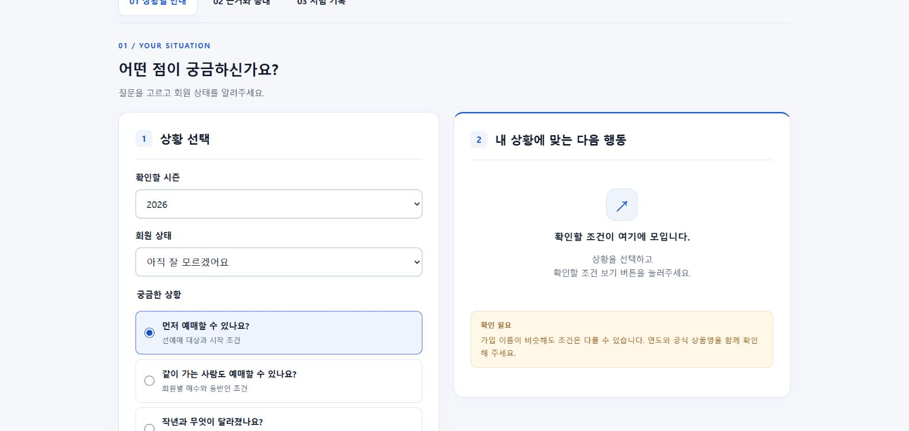

# FANBRIDGE — 삼성 팬 안내 개선 실험

삼성 라이온즈 팬의 질문에서 문제를 발견하고, 안내·응대 기준을 개선한 뒤 실제 팬 과제로 검증하기 위한 개인 고객경험(CX) 프로젝트입니다.

## 시작 문서

- [최신 PRD v03](fanbridge-2026-09-30-v01/PRD_FANBRIDGE_2026-09-30-v03.md)
- [삼성 공개 문의 초기 탐색](fanbridge-2026-09-30-v01/SAMSUNG_FAN_INQUIRY_RESEARCH_2026-09-30-v01.md)
- [데이터·API 조사](fanbridge-2026-09-30-v01/DATA_API_RESEARCH_2026-09-30-v01.md)
- [최신 시제품 사용 안내](fanbridge-2026-09-30-v01/prototype-2026-10-01-v02/사용안내.md)

## 실행

Python 3이 설치된 환경에서 저장소 최상위의 터미널에 아래 명령을 입력합니다.

```sh
python -m http.server 8766 --bind 127.0.0.1 --directory projects/fanbridge/fanbridge-2026-09-30-v01/prototype-2026-10-01-v02
```

브라우저에서 <http://127.0.0.1:8766/>에 접속합니다. 이미 해당 포트를 사용하는 프로그램이 있다면 다른 번호로 실행하고 주소도 같은 번호로 변경합니다. 설치할 외부 라이브러리는 없습니다.

## 구현 범위

- 시즌·회원 상태·질문·동반 인원에 따른 확인 안내
- 공식 자료 경로와 응대 확인 순서
- 연습 기록의 시간 측정·브라우저 저장·JSON 내보내기
- 질문 선택 카드, 결과 조건 요약, 입력 변경 피드백, 모바일 배치·키보드 초점

이 시제품은 공식 삼성 서비스가 아닙니다. 세부 정책 정답은 미검증이며 선예매 자격을 확정하지 않습니다. 기록은 연습용이고 실제 팬 효과는 미측정입니다. 과제별 시간·정답·동의·참가자 배정은 실제 시험 전에 구현·확정해야 합니다. 브라우저 저장 자료는 Git에 포함되지 않습니다.

## 검사

Node.js가 설치된 환경에서 실행합니다.

```sh
node projects/fanbridge/fanbridge-2026-09-30-v01/prototype-2026-10-01-v02/check.cjs
```

과거 정책 혼용 방지, 인원 검증, 중단·도움 요청·시간 초과·실제 자료 분리를 검사합니다. 2026-10-01 크롬에서 안내·연습 기록 저장 동작, 375px 화면의 가로 넘침 없음을 확인했습니다. 실제 팬 모집·효과 시험은 수행하지 않았습니다.

v01·v02 시제품 및 이전 PRD는 변경 전후를 비교할 수 있도록 보존했습니다.


